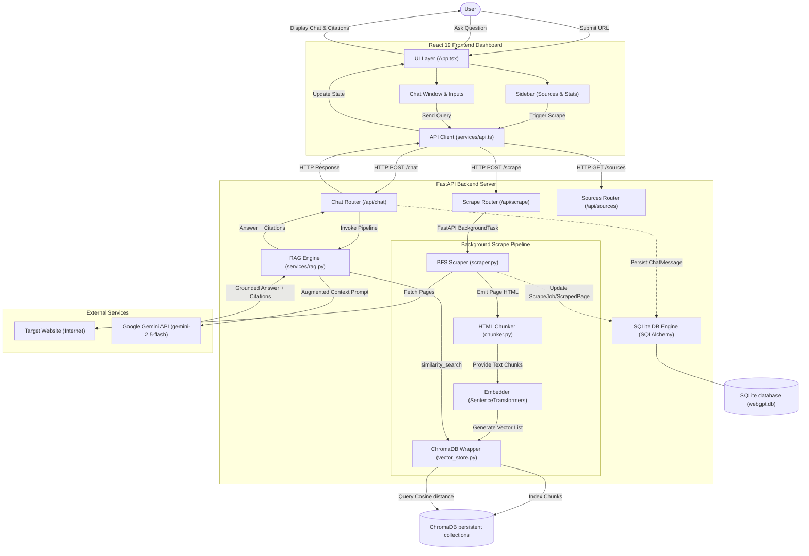
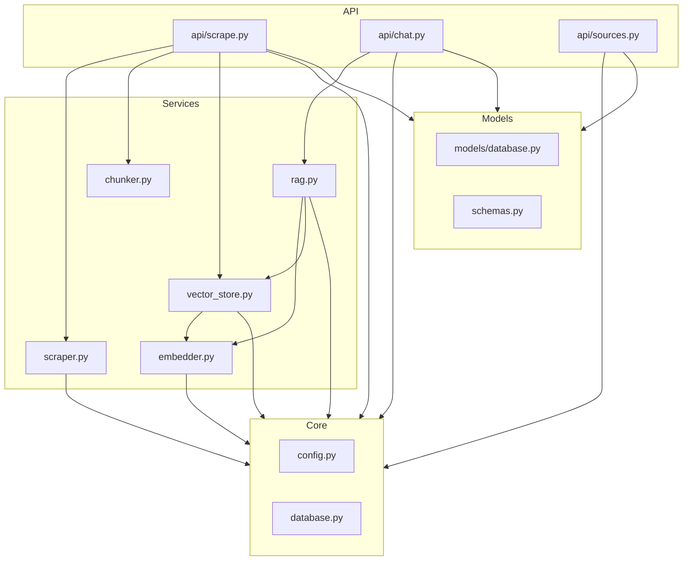
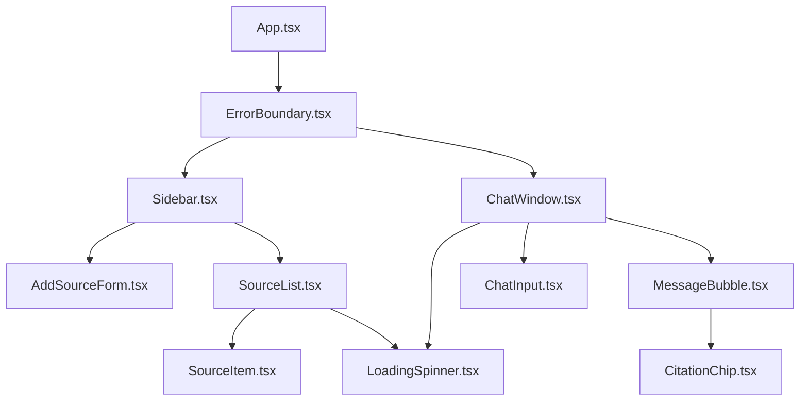
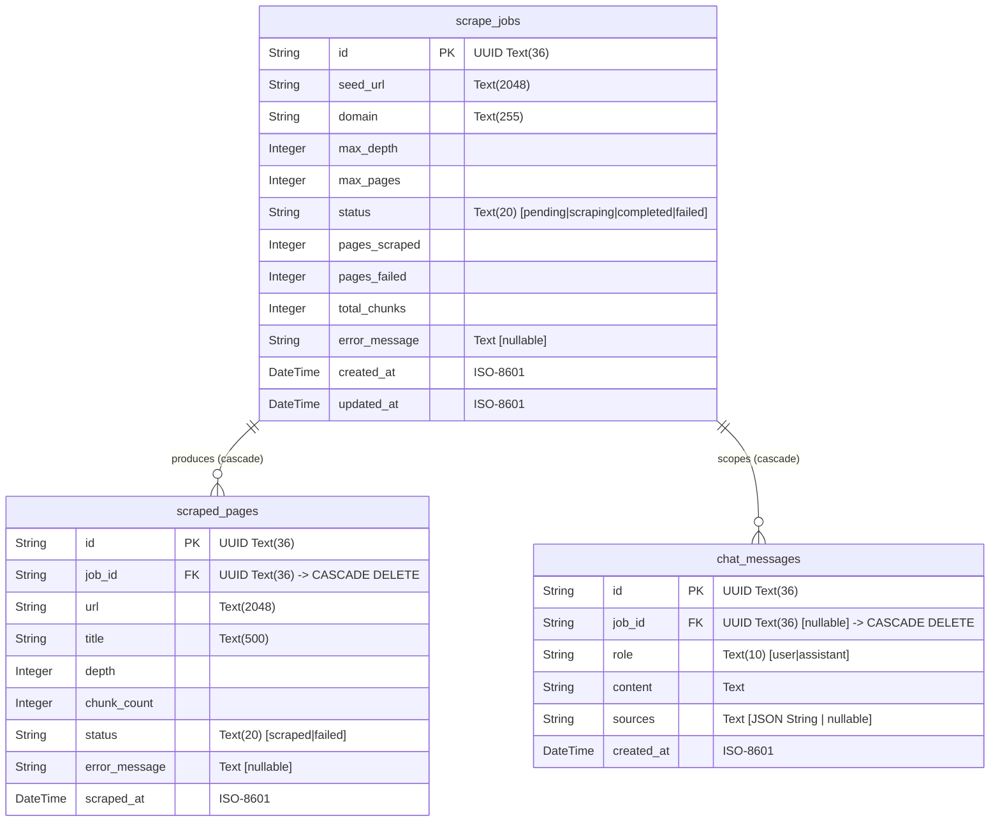
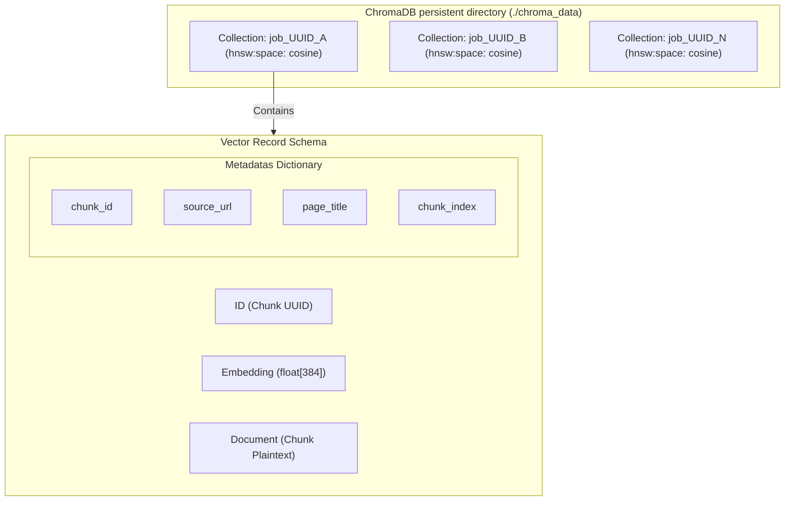
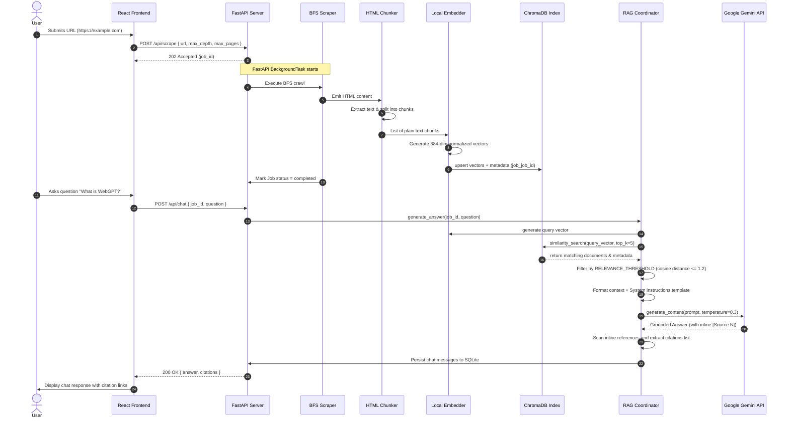

# WebGPT RAG Chatbot

## Version 1.0 Architecture & Implementation Guide

---

### 1. Executive Summary

WebGPT is an end-to-end Retrieval-Augmented Generation (RAG) web application that enables users to input a seed URL, scrape the website recursively within compliance rules, generate semantic vector embeddings from the page content, store them in a vector database, and engage in a grounded conversation with an LLM.

#### Core Objectives
* **Information Grounding:** Prevent hallucinations by forcing LLM responses to be derived strictly from scraped website text.
* **Traceability:** Provide user-auditable inline citations mapped directly to source URLs and page titles.
* **Sovereignty & Isolation:** Ensure scraped data is securely stored, tracked, and purgeable on a per-domain basis.
* **Compliant Scraping:** Crawl recursively while respecting `robots.txt` paths and preventing server-side requests to private/internal loopback ranges.

#### Key Capabilities
* **BFS Web Scraper**: An asynchronous queue-based crawler enforcing maximum depth and page limits.
* **Embedding Pipeline**: Automatic HTML extraction, semantic tag cleaning, and chunking coupled with a thread-safe, local `SentenceTransformer` embedder.
* **Vector Indexing**: Dynamically managed ChromaDB instances using a collection-per-scrape-job isolation model.
* **RAG Prompt Engine**: Distance-filtered contextual retrieval fed into a temperature-restricted Gemini model via the Google Generative AI SDK.
* **Rich Dashboard**: Responsive React 19 UI featuring global/source-specific chat tabs, ingestion tracking widgets, and custom markdown rendering.

#### Version Information
* **Core Version**: v1.0.0
* **API Spec**: OpenAPI 3.0 (FastAPI auto-generated)
* **Target Release Date**: June 28, 2026

---

### 2. Problem Statement

#### What Problem Is Being Solved?
Standard Large Language Models (LLMs) suffer from temporal knowledge cutoff, lack of access to private/proprietary web content, and a tendency to "hallucinate" plausible-sounding but false answers when queried on niche or domain-specific facts.

#### Why RAG Is Required
Training or fine-tuning models on specific website data is slow, expensive, and impractical for real-time information access. Retrieval-Augmented Generation (RAG) separates *knowledge storage* (web search/databases) from *reasoning capability* (LLM inference). By injecting relevant content directly into the model's immediate context window, the system provides accurate, real-time grounding.

#### Traditional LLM Limitations
* **Hallucinations**: Inventing facts when missing training data.
* **Lack of Citations**: Inability to point to the exact source documents that justify an assertion.
* **Resource Cost**: Inability to dynamically index a new website on the fly without heavy model training pipelines.

#### How WebGPT Solves the Problem
WebGPT solves these constraints through a synchronized pipeline:
1. **Targeted Ingestion**: User inputs a domain seed URL.
2. **Local Vectorization**: The system extracts structural text segments, calculates semantic vectors, and indexes them locally.
3. **Augmented Synthesis**: The RAG prompt builder grabs the top-K chunks using cosine similarity, builds an inline reference context block, and commands the Gemini API to respond *only* from the retrieved content, outputting corresponding source citations.

---

### 3. High-Level System Architecture

The following diagram illustrates the unidirectional data flow from seed URL submission to context-grounded response generation.



---

### 4. Technology Stack

The project selects components optimized for speed, local vector capabilities, and low-cost, high-reasoning inference:

| Layer | Component | Chosen Technology | Rationale |
| :--- | :--- | :--- | :--- |
| **Frontend** | Framework | **React 19** | Industry standard, leverages React 19 StrictMode and functional hook patterns for performant components. |
| **Frontend** | Language | **TypeScript** | Static typing prevents schema mapping mismatches and compile-time integration errors. |
| **Frontend** | Styling | **Tailwind CSS v4** | Provides high-performance styling, CSS-first configurations, and modern UI capabilities. |
| **Frontend** | Bundler | **Vite 6** | Immediate Hot Module Replacement (HMR) and fast build packaging. |
| **Backend** | Framework | **FastAPI** | Extremely fast web framework. Built-in async event loops and automatic OpenAPI validation. |
| **Backend** | ORM | **SQLAlchemy 2.0 (Async)** | Provides clean async mapping layer supporting SQLite asynchronous operations. |
| **Backend** | Database | **SQLite** | Local zero-configuration engine. Excellent for isolated hackathon deployment and WAL-mode. |
| **AI Layer** | LLM | **Gemini 2.5 Flash** | Extreme speed, huge context window, low cost, and strong reasoning on structured context. |
| **AI Layer** | Embeddings | **SentenceTransformers** | Runs locally (zero cost) using the highly balanced `all-MiniLM-L6-v2` model (384-dimensions). |
| **Vector DB** | Storage | **ChromaDB** | Native Python persistent vector database. Ideal for local deployment and simple metadata filtering. |

---

### 5. Backend Architecture

The backend code resides in `backend/app/` and is divided into clean architectural layers:

```
backend/app/
├── __init__.py
├── main.py                   # FastAPI Application Entrypoint
├── core/
│   ├── config.py             # Settings loading via Pydantic
│   └── database.py           # Async SQLite engine & Session factory
├── models/
│   ├── database.py           # SQLAlchemy ORM schemas (Jobs, Pages, Messages)
│   └── schemas.py            # Pydantic schema wrappers
├── api/
│   ├── scrape.py             # Scraper pipeline trigger and monitoring API
│   ├── chat.py               # RAG chat execution and history API
│   └── sources.py            # Source manager pagination API
└── services/
    ├── scraper.py            # Async Web crawler service
    ├── chunker.py            # Semantic HTML cleaner and text segmenter
    ├── embedder.py           # SentenceTransformers model singleton
    ├── vector_store.py       # ChromaDB persistent collection coordinator
    └── rag.py                # Pipeline coordinator & Gemini API client
```

#### Layer Responsibilities
1. **Core Layer (`app/core`)**: Loads variables from the gitignored `.env` file into a type-safe `Settings` singleton. Bootstraps the SQLite database engine, enables **Write-Ahead Logging (WAL)**, and exposes the `get_db` scoped session dependency.
2. **Models Layer (`app/models`)**: Defines ORM database structures (`Base` metadata) and matching Pydantic response models to enforce contract integrity.
3. **API Routing Layer (`app/api`)**: Translates HTTP parameters into database filters. Schedules expensive CPU/Network crawls to FastAPI's non-blocking `BackgroundTasks`.
4. **Services Layer (`app/services`)**: Contains the core logic. No API concerns are handled here; services accept inputs and output structured types.



---

### 6. Frontend Architecture

The frontend is constructed as a Single Page Application (SPA) structured around a centralized workspace shell.

```
frontend/src/
├── main.tsx                  # Application Entrypoint
├── index.css                 # CSS variables, custom scrollbars, and prose formatting
├── vite-env.d.ts             # TypeScript definitions for Vite env
├── types/
│   └── api.ts                # TypeScript interfaces mirroring FastAPI schemas
├── services/
│   └── api.ts                # Typed fetch client with normalized error handling
├── hooks/
│   ├── useSources.ts         # Hook to load, refresh, and delete data sources
│   ├── useChat.ts            # Hook to control scoped/global chat and reload history
│   └── useScrapePolling.ts   # Hook to auto-refresh active crawl statuses every 3s
└── components/
    ├── common/
    │   ├── ErrorBoundary.tsx # Global layout fallback error catcher
    │   └── LoadingSpinner.tsx# SVG-based visual loading state
    ├── sidebar/
    │   ├── Sidebar.tsx       # Side panel layout, metrics aggregator
    │   ├── AddSourceForm.tsx # URL input validation and scrape launcher
    │   ├── SourceList.tsx    # List trigger for specific/global targets
    │   └── SourceItem.tsx    # Source item showing status, page count, and chunks
    └── chat/
        ├── ChatWindow.tsx    # Main conversation container
        ├── MessageBubble.tsx # Bot/User bubble, custom markdown prose
        ├── ChatInput.tsx     # Smart textarea component (Enter to send)
        └── CitationChip.tsx  # Interactive citation anchor link
```

#### Component Hierarchy Diagram



---

### 7. Database Design

WebGPT uses a local SQLite database for structured storage. The database leverages **WAL (Write-Ahead Logging)** mode. This is crucial for a web application where background crawl workers write scrape results concurrently while users execute read requests for status updates and chat history.

#### Database Schema ERD



#### Table Definitions

1. **`scrape_jobs`**
   * **Purpose**: Tracks ingestion tasks. Represents a single crawl source.
   * **Columns**:
     * `id`: `String(36)`, Primary Key, UUID.
     * `seed_url`: `String(2048)`, the initial URL provided.
     * `domain`: `String(255)`, extracted hostname.
     * `status`: `String(20)`, current pipeline state (`pending`, `scraping`, `completed`, `failed`).
     * `pages_scraped`, `pages_failed`, `total_chunks`: `Integer` metrics.
     * `error_message`: `Text`, stores crash traces if status is `failed`.
2. **`scraped_pages`**
   * **Purpose**: Logs every page processed during crawling.
   * **Columns**:
     * `id`: `String(36)`, Primary Key, UUID.
     * `job_id`: `String(36)`, Foreign Key referencing `scrape_jobs(id)` with `ON DELETE CASCADE`.
     * `url`, `title`: metadata.
     * `depth`: BFS layer level (starts at 0).
     * `chunk_count`: total chunks extracted.
     * `status`: `scraped` or `failed`.
3. **`chat_messages`**
   * **Purpose**: Persists user and assistant messages for a source.
   * **Columns**:
     * `job_id`: Foreign Key referencing `scrape_jobs(id)` with `ON DELETE CASCADE`. If `NULL`, represents the **Global Search Mode** conversation scope.
     * `sources`: JSON string storing lists of citation metadata: `[{"source_url": "...", "page_title": "..."}]`.

---

### 8. ChromaDB Design

WebGPT employs an **isolated collection-per-job design** inside ChromaDB.



#### Collection-Per-Job Isolation
Each scrape job gets its own collection named `job_{job_id}`. This model guarantees:
* **Instant Deletions**: Deleting a source is a simple `delete_collection` call. This avoids slow metadata index sweeps.
* **No Context Contamination**: During scoped chat queries, similarity lookups are confined strictly to the job's collection.

#### Vector Storage Strategy
* **Embedding Model**: `all-MiniLM-L6-v2` generating 384-dimensional floating-point arrays.
* **Distance Metric**: Cosine Distance. We configure this by setting the collection metadata: `{"hnsw:space": "cosine"}`.
* **Batched Insertion**: SQLite constraints limit bulk insertions. ChromaDB limits batch upserts to a maximum block size of 5,000 items.

#### Metadata Schema
Each vector is saved with the following JSON schema metadata:
```json
{
  "chunk_id": "uuid-string",
  "source_url": "https://example.com/subpage",
  "page_title": "Subpage Title",
  "chunk_index": 4
}
```

---

### 9. RAG Pipeline

The RAG architecture follows a strict Retrieve-Augment-Generate pattern:



#### Detailed Pipeline Breakdown
1. **SSRF Gate**: The endpoint checks the URL scheme (only `http`/`https` allowed) and resolves its IP. It blocks requests resolving to loopbacks or private ranges (`127.0.0.0/8`, `10.0.0.0/8`, etc.).
2. **Scraper BFS Queue**: The scraping task uses `aiohttp` for non-blocking HTTP requests. It reads robots.txt and follows a breadth-first search path up to `max_depth` (default 2) and `max_pages` (default 50) limits.
3. **HTML Sanitization**: The chunker parses HTML, strips `<script>`, `<style>`, and navigation blocks, extracts headers and text paragraphs, and joins them cleanly.
4. **Recursive Chunking**: Text is split into 1,000-character segments with a 200-character overlap. This overlap ensures key context is not split between boundaries.
5. **Local Vectorization**: Chunks are embedded into 384-dimensional vectors using local SentenceTransformers.
6. **Collection Insertion**: Chunks are loaded into the corresponding ChromaDB collection `job_{job_id}`.
7. **Scoped/Global Similarity Search**: When a user queries WebGPT, the search query is embedded. If the request is scoped to a `job_id`, the system queries that collection. If `job_id` is `null` (Global Search Mode), the engine lists all job collections, queries them, merges the results, and sorts them by distance.
8. **Threshold Filtering**: Chunks with a cosine distance greater than `1.2` (configured in settings) are discarded.
9. **Prompt Engineering**: The retrieved text chunks are formatted into the system prompt context:
   ```
   [Source N] (from: Title — URL):
   Text content here...
   ```
   The model is instructed to answer using *only* this context. If the query cannot be answered, it must reply with: *"I don't have enough information from the scraped content to answer this question."*
10. **Gemini Inference**: The GenerativeModel client sends the prompt to `gemini-2.5-flash` with a restricted temperature setting (`0.3`) for deterministic, grounded content generation.
11. **Citation Parsing**: The pipeline extracts citations by scanning the response for `[Source (\d+)]` regex patterns. It maps these indexes to their source URL and page title metadata.

---

### 10. API Documentation

#### Endpoint Registry

| Route | Method | Request Schema | Response Schema | Description |
| :--- | :--- | :--- | :--- | :--- |
| `/api/scrape` | `POST` | `ScrapeRequest` | `ScrapeResponse` | Starts background crawl. Returns 202 Accepted. |
| `/api/scrape/{job_id}` | `GET` | *None* | `ScrapeStatusResponse` | Returns active progress metrics and list of pages. |
| `/api/scrape/{job_id}` | `DELETE` | *None* | *None* (204 No Content) | Deletes ChromaDB collections and SQLite rows. |
| `/api/chat` | `POST` | `ChatWebRequest` | `ChatWebResponse` | Grounded QA search. Returns generated answer and citations. |
| `/api/chat/history/{job_id}` | `GET` | *None* | `WebChatHistoryResponse` | Returns past conversation list. |
| `/api/sources` | `GET` | *None* | `list[SourceSummary]` | Returns paginated list of all active sources. |
| `/health` | `GET` | *None* | `{"status": "healthy"}` | Standard API monitoring health check. |

#### Request/Response Schemas

##### `ScrapeRequest`
* **JSON Properties**:
  * `url`: `str` (URI required, min length 1)
  * `max_depth`: `int` (optional, default 2)
  * `max_pages`: `int` (optional, default 50)
* **Validation**: Regulated by URL scheme checks and SSRF block lists.

##### `ScrapeResponse`
* **JSON Properties**:
  * `job_id`: `str` (UUID)
  * `status`: `str` (default `pending`)
  * `seed_url`: `str`
  * `created_at`: `str` (ISO DateTime)

##### `ChatWebRequest`
* **JSON Properties**:
  * `job_id`: `str` | `null` (Job UUID, or `null` for Global Search)
  * `question`: `str` (min length 1, max length 1000)

##### `ChatWebResponse`
* **JSON Properties**:
  * `answer`: `str`
  * `citations`: `list[CitationInfo]`

---

### 11. Module-by-Module Breakdown

#### 1. `scraper.py`
* **Responsibility**: Recursive breadth-first web crawling.
* **Key Algorithms**: Implements an asynchronous queue parsing URLs by domain. It parses `robots.txt` paths to check compliance rules.
* **Error Handling**: Uses `asyncio.TimeoutError` catches to skip slow domain servers. It handles 4xx/5xx status codes by logging them to `scraped_pages` as failures.

#### 2. `chunker.py`
* **Responsibility**: Clean DOM trees and segment raw text.
* **Key Algorithms**: Uses `BeautifulSoup` to strip script and style tags. It groups text into structural paragraphs and chunk segments of length `CHUNK_SIZE` with overlap `CHUNK_OVERLAP`.
* **Inputs**: HTML document string, source URL, page title.
* **Outputs**: List of structured chunk dictionaries.

#### 3. `embedder.py`
* **Responsibility**: Generate dense embedding vectors.
* **Key Algorithms**: Employs a thread-safe double-checked lock pattern (`threading.Lock`) to load the `SentenceTransformer` singleton model into CPU memory once. It verifies vector sizes through dummy health checks.
* **Outputs**: `list[list[float]]` representing the dense embedding vectors.

#### 4. `vector_store.py`
* **Responsibility**: chromaDB collections database operations.
* **Key Algorithms**: Handles creation, deletion, upserting, and querying of collections. Upserts chunk batches up to `BATCH_SIZE = 5000` to prevent SQLite write lockouts.

#### 5. `rag.py`
* **Responsibility**: Coordinate RAG query flow and call the Gemini API.
* **Key Algorithms**: Performs similarity searches across collections. Discards nodes using `RELEVANCE_THRESHOLD` checks, formats prompt templates, and calls `google.generativeai.GenerativeModel.generate_content`. It extracts inline references via `\[Source (\d+)\]` regex.

---

### 12. Frontend Components

1. **`Sidebar`**: Layout manager for the side panel. Combines the `AddSourceForm`, `SourceList`, and a metrics component displaying the total page and chunk count in the workspace.
2. **`AddSourceForm`**: Provides form validation for URL entries. Displays interactive spinner animations during request submissions.
3. **`SourceList`**: Renders the sources list feed. Includes a "Global Search Mode" trigger that sets `activeSourceId = null`.
4. **`SourceItem`**: Displays source metrics (Pages Scraped, Total Chunks) and status badges. Statuses map to custom styles:
   * `pending`: Slate badge
   * `scraping`: Amber pulsing badge
   * `completed`: Emerald badge
   * `failed`: Red badge
5. **`ChatWindow`**: Controls the scroll feed and empty chat states. Auto-scrolls to the bottom on new message events.
6. **`MessageBubble`**: Displays assistant and user message layouts. Leverages `react-markdown` to render formatted headers, lists, code blocks, and strong elements.
7. **`CitationChip`**: Displays citation link chips pointing to source URLs. Displays exact page titles inside hover tooltips.

---

### 13. Security Considerations

WebGPT enforces a secure execution layer at the server boundary:

* **SSRF (Server-Side Request Forgery) Protection**: Input validation resolves domains via `socket.getaddrinfo`. It blocks local addresses (`127.0.0.1`, `localhost`), link-local scopes (`169.254.0.0/16`), and private subnets (`10.0.0.0/8`, `172.16.0.0/12`, `192.168.0.0/16`) to protect internal networks.
* **Robots.txt Compliance**: The scraper parses the seed domain's `/robots.txt` using the standard `urllib.robotparser`. It skips crawl-blocked paths.
* **Scope Locking**: Scraped subpages are strictly restricted to the seed URL domain path.
* **Secrets Separation**: The `GEMINI_API_KEY` is loaded from a gitignored local `.env` file. It is never logged or exposed in client responses.

---

### 14. Performance Considerations

* **Asynchronous Scraper**: Crawling uses asynchronous networks requests via `aiohttp` and `asyncio.gather`.
* **Embedding Batching**: Embedding generation vectors are processed in blocks of 32. This speeds up processing compared to encoding single items sequentially.
* **SQLite WAL Mode**: Enables concurrent read operations while background scrape tasks write to the database.
* **Lazy Loading**: The heavy SentenceTransformers model is loaded into memory only when the first scraping or query job starts.
* **Polling Strategy**: The React frontend polls `/api/scrape/{job_id}` every 3 seconds while crawling is active. Once the status changes to `completed` or `failed`, polling stops automatically.

---

### 15. Error Handling Strategy

```
           [ Runtime Errors & Exceptions ]
                         │
        ┌────────────────┴────────────────┐
        ▼                                 ▼
 [Backend Exceptions]            [Frontend Errors]
  • Try/Except catch blocks       • Error Boundary Catch
  • Log traceback with Logger     • Toast Deck alerts
  • Normalize status response     • Message bubble error banner
  • Map to standard HTTP status   • Disabled inputs during load
```

* **Backend Exception Normalization**: Backend processes catch errors locally, log details using Python's logging library, and return standardized HTTP status codes:
  * Network Timeout: `HTTP 408`
  * Invalid URLs: `HTTP 422`
  * Missing Jobs: `HTTP 404`
  * Gemini API Rate Limits: `HTTP 503` (with a friendly request recovery message)
* **Frontend Error Boundaries**: The React layout is wrapped in an `ErrorBoundary` class component that displays a graceful error screen instead of crashing the UI.
* **UI Toast Deck Alerts**: Actions like deletion failures or crawl issues trigger a toast alert at the top right of the dashboard.

---

### 16. Development Timeline

The application was built systematically over five developmental iterations, verified by the Git repository logs:

```
┌────────────────────────────────────────────────────────┐
│ Phase 1: Foundation (commits d2dfca3 to e4dd39f)       │
└───────────────────────────┬────────────────────────────┘
                            │
┌───────────────────────────▼────────────────────────────┐
│ Phase 2: Services (commits e13c76d to 54cd1f1)         │
└───────────────────────────┬────────────────────────────┘
                            │
┌───────────────────────────▼────────────────────────────┐
│ Phase 3: RAG APIs (commits a38fd5b to 1f1abe1)         │
└───────────────────────────┬────────────────────────────┘
                            │
┌───────────────────────────▼────────────────────────────┐
│ Phase 4: Frontend (commits 0d0bdd7 to f1c6aa9)         │
└───────────────────────────┬────────────────────────────┘
                            │
┌───────────────────────────▼────────────────────────────┐
│ Phase 5: Audit & Polish (commit e2efc6a)               │
└────────────────────────────────────────────────────────┘
```

#### Commit Timeline Log Evidence
1. **Phase 1 — Foundation**
   * Configured setup schemas, Settings overrides, SQLite engine session scopes, ORM models, and the FastAPI base entry point. (Commits: `d2dfca3`, `b55225b`, `c28199a`, `6310b61`, `510de42`, `b6b6869`, `e65269f`, `e4dd39f`).
2. **Phase 2 — Scraper & Embeddings**
   * Created the BFS scraping worker, semantic chunk splitter, SentenceTransformer model singleton, and ChromaDB persistence wrapper. (Commits: `e13c76d`, `d809f22`, `919f56f`, `54cd1f1`).
3. **Phase 3 — RAG Pipeline**
   * Implemented prompt engineering, the Gemini generative client integration, `/api/scrape`, `/api/chat`, and `/api/sources` API routes. (Commits: `a38fd5b`, `0aee6ec`, `aecd192`, `1f1abe1`).
4. **Phase 4 — Frontend**
   * Built the React dashboard, TypeScript API types, central API client, state Hooks, Sidebar list components, Chat message cards, and scrape polling loop. (Commits: `0d0bdd7`, `0bce753`, `3f0cbb0`, `4d9889c`, `f1c6aa9`).
5. **Phase 5 — Testing & Polish**
   * Added `vite-env.d.ts` types, resolved `import time` NameErrors, fixed query validation settings, corrected invalid color codes, and added markdown styling in `index.css`. (Commit: `e2efc6a`).

---

### 17. Major Engineering Decisions

#### 1. Why FastAPI?
* **Options Considered**: Django, Flask, FastAPI.
* **Chosen Solution**: FastAPI.
* **Trade-Offs**: Excellent async support, automatic Pydantic validation, and OpenAPI documentation. It does not include built-in admin panels or complex session stores, but these are not needed for a lightweight RAG api.

#### 2. Why SQLite?
* **Options Considered**: PostgreSQL, MySQL, SQLite.
* **Chosen Solution**: SQLite.
* **Trade-Offs**: SQLite is serverless, zero-config, and files are stored in the workspace directory. We enabled WAL mode to support concurrent writes from crawl workers and reads from chat queries.

#### 3. Why ChromaDB?
* **Options Considered**: Pinecone, pgvector, ChromaDB.
* **Chosen Solution**: ChromaDB.
* **Trade-Offs**: Runs embedded in the Python process and persists to a local directory, avoiding remote network costs. It is not suitable for horizontally scaled multinode clusters, but perfect for single-instance applications.

#### 4. Why Local Embeddings (SentenceTransformers)?
* **Options Considered**: OpenAI Embeddings, Gemini Embeddings, local `all-MiniLM-L6-v2`.
* **Chosen Solution**: Local `all-MiniLM-L6-v2`.
* **Trade-Offs**: Zero cost, runs entirely offline, and generates vectors in a CPU thread pool. It has a slightly higher CPU footprint than API models but removes external service dependencies.

#### 5. Why Collection-Per-Job?
* **Options Considered**: Single collection with metadata filtering, collection-per-job.
* **Chosen Solution**: Collection-per-job.
* **Trade-Offs**: Ensures complete data isolation for queries and allows instant deletion of sources. However, executing a global query across multiple sources requires querying each collection individually and merging results in memory.

#### 6. Why Not LangChain?
* **Options Considered**: LangChain/LlamaIndex, Vanilla Python implementations.
* **Chosen Solution**: Vanilla Python implementations.
* **Trade-Offs**: Writing the scraping, chunking, and prompt injection code manually keeps the codebase clean, readable, and easy to debug. It avoids the large dependency stack and complex abstractions of third-party orchestrators.

---

### 18. Challenges Encountered

#### 1. RAG pipeline crash (NameError on `time` module)
* **Issue**: Every chat query crashed with `NameError: name 'time' is not defined`.
* **Root Cause**: The RAG pipeline tracked inference duration using `time.time()`, but `import time` was missing in `rag.py`.
* **Resolution**: Added `import time` to `rag.py`.

#### 2. FastAPI Query parameter validation issues
* **Issue**: Negative limits and offsets were accepted on `/api/sources` calls.
* **Root Cause**: The route parameters used Pydantic `Field()` instead of FastAPI `Query()` to define constraints.
* **Resolution**: Updated `sources.py` to use `Query(default=10, ge=1, le=100)`.

#### 3. Unstyled chat messages (Missing markdown styling)
* **Issue**: Bot responses rendered as unstyled plain text blocks without margins, headers, or bullet lists.
* **Root Cause**: The components used `react-markdown` inside Tailwind's `prose` container, but the `@tailwindcss/typography` plugin was not configured in `package.json`.
* **Resolution**: Added custom CSS rules for `.prose` in `index.css` to style headings, lists, tables, and code blocks cleanly with zero dependencies.

---

### 19. Future Roadmap

#### Version 1.0 (Current Implementation)
* BFS scraper with robots.txt parsing and SSRF guards.
* Isolated collection-per-job ChromaDB vector indexes.
* Scoped and global search chat modes using `gemini-2.5-flash`.
* SQLite WAL-enabled persistence.
* Sleek React 19 UI with toast notifications.

#### Version 1.1 (Realistic Improvements)
* **Visual Chunk Highlighting**: Show the retrieved source context chunks in a side panel.
* **Dynamic Search Configuration**: Expose `max_depth` and `max_pages` controls in the frontend form.
* **Retry Pipeline**: Implement automatic network retry handling for scraped subpages.

#### Version 1.2
* **Cross-Source Search Filters**: Add check-box filters to the sidebar to scope search queries to selected sources.
* **Crawl Scheduling**: Configure cron-like scraping schedules to periodically update website vectors.

#### Version 2.0
* **Multi-User Workspace Sessions**: Implement JWT authentication and session stores to isolate user indices.
* **Hybrid Search Indexing**: Combine dense vector retrieval with keyword BM25 search.

---

### 20. Conclusion

WebGPT Version 1.0 is a RAG-powered chatbot. It combines asynchronous crawling with semantic chunking, local vector embeddings, SQLite database transactions, and the Google Gemini API to build a grounded question-answering tool.

#### Key Technical Achievements
1. **Isolated ChromaDB Architecture**: Guarantees zero context contamination between different scraped domains.
2. **SSRF Guard**: Resolves DNS records to prevent crawling of private range IPs.
3. **Vanilla Integration**: Built without third-party frameworks like LangChain, keeping the backend clean and easy to maintain.
4. **Lightweight Styling**: Customized Tailwind v4 classes in `index.css` provide beautiful typography without extra packages.

WebGPT shows how local search indexes can ground generative AI models, offering a secure, trace-cited, and compliant solution for domain-specific web searches.
