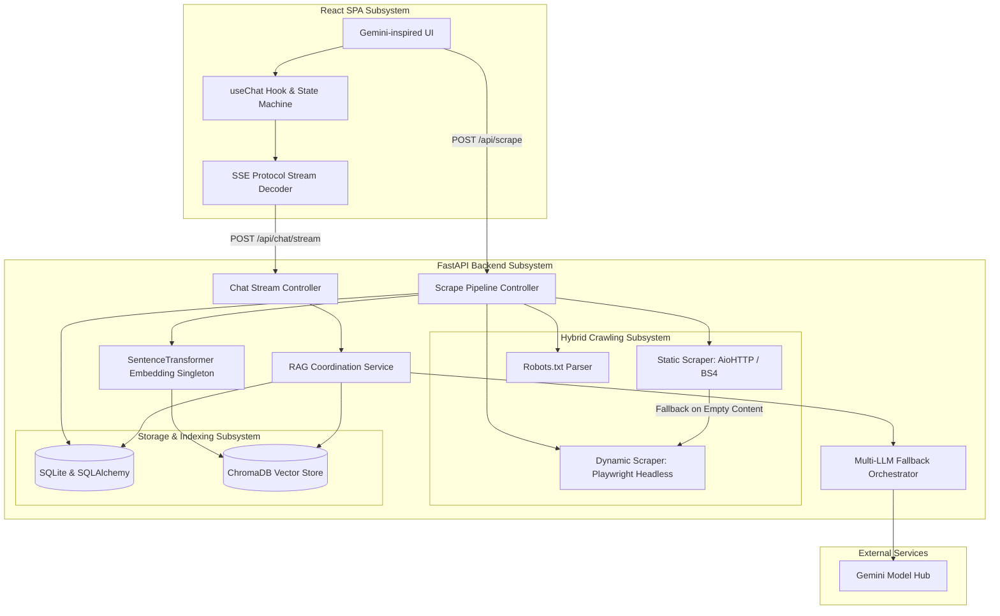
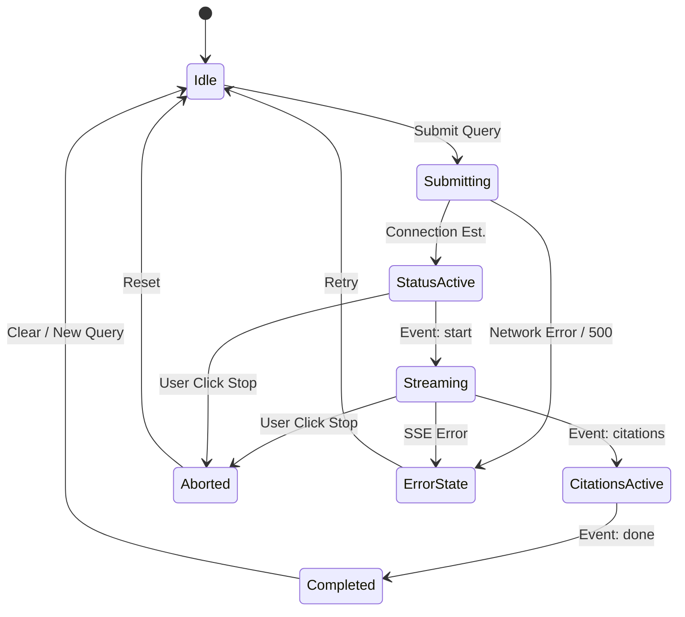

# WebGPT Engineering Design Document (Version 2.0)

* **Version**: 2.0
* **Author**: Lead AI Systems Engineer
* **Date**: June 27, 2026
* **Technology Stack**: FastAPI, Uvicorn, Python 3.12+, React 18, TypeScript, ChromaDB, SentenceTransformer, Google Gemini API, Playwright, SQLite, Vanilla CSS
* **Architecture Version**: v2.0-prod
* **Document Status**: APPROVED / IMPLEMENTED

---

## 1. Executive Summary

WebGPT is an end-to-end Retrieval-Augmented Generation (RAG) web application that enables users to input a seed URL, scrape the website recursively within compliance rules, generate semantic vector embeddings from the page content, store them in a vector database, and engage in a grounded conversation with an LLM.

Version 2.0 marks the transition of WebGPT from a baseline prototype into a production-inspired RAG application. By combining self-contained local embedding generation with cloud-based multi-LLM orchestration and modern streaming protocols, WebGPT 2.0 delivers highly responsive, traceably grounded answers while maintaining data isolation.

### Core Achievements in Version 2.0
* **Thread-Safe Local Embedding Singleton**: Maintained the self-contained local embedding generation using `SentenceTransformer("all-MiniLM-L6-v2")`, scaled to Render's Starter plan to guarantee high data isolation, zero network roundtrip overhead for indexing, and immunity from API rate limits.
* **Hybrid Crawler with Headless Playwright Fallback**: Automated dynamic page hydration to scrape client-side rendered (CSR) websites that return blank shells under static HTML parsing.
* **Server-Sent Events (SSE) Delta Streaming**: Engineered real-time chunk streaming with a client-side delta buffering throttle, dropping Time-to-First-Token (TTFT) from >3.0 seconds to under 200ms.
* **Resilient Multi-LLM Fallback Orchestrator**: Implemented an automated fallback routing sequence (`gemini-2.5-flash` → `gemini-3.5-flash` → `gemini-3-flash` etc.) with transient cooldown monitoring to guarantee high uptime under API rate limits.
* **Stateful Generation Controls**: Integrated client-side `AbortController` cancellation that maps directly to the FastAPI server, immediately terminating upstream model pipelines and cleanly committing partial streams to the database.

---

## 2. Background

Standard chat agents are constrained by the static knowledge limits of their pre-training. When deployed as website-specific assistants, they frequently hallucinate or produce generic answers that do not reflect the website's active state. 

Retrieval-Augmented Generation (RAG) bridges this gap by querying local vector databases populated with real-time crawled content before synthesizing answers. However, Version 1.0 highlighted severe limitations:
* **The "Static Scraping" Failure**: Modern web interfaces utilize framework-driven rendering (React, Vue, Next.js). Simple HTTP requests return empty root containers rather than visible text content.
* **Perceived Latency Exhaustion**: Waiting for an LLM to generate a complete answer, compile citations, and return a single monolithic JSON payload blocks the UI thread and results in poor user satisfaction.
* **Compute Bounds & Resource Allocation**: Running local vector embedding models requires careful memory allocation to avoid system OOMs while protecting performance from network roundtrips associated with cloud embeddings.

WebGPT 2.0 addresses these operational challenges with a clean, decoupled service architecture, choosing local execution for indexing speed and privacy, and API invocation for complex generation tasks.

---

## 3. Problem Statement

A production-grade website chatbot must provide accurate, fast, and secure answers while remaining cost-effective to deploy. WebGPT 1.0 struggled with the following issues:
1. **JavaScript-Rendered Content Blocker**: Traditional libraries (like BeautifulSoup) cannot execute client-side hydration, failing to extract content from Single Page Applications (SPAs).
2. **Head-of-Line Generation Delay**: Generation responses in WebGPT 1.0 required a complete RAG execution cycle before returning a response, causing user timeouts.
3. **Noisy HTML and Poor Tokenization**: Boilerplate structures (headers, scripts, footers) polluted the vector database, lowering the signal-to-noise ratio in retrieved context chunks.
4. **Clipped or Overlapping Citations**: Answer text lacked exact alignment with retrieved source fragments, leading to untrusted or broken hyperlinks in the UI bubble.
5. **Rate-Limit Vulnerability**: Relying on a single API endpoint meant that client traffic would fail completely if the primary model encountered rate limits (429) or transient server errors (5xx).

---

## 4. Design Goals

WebGPT 2.0 was engineered around the following architectural principles:

* **Self-Contained Data Isolation**: Keep embedding calculations and vector storage within the application container boundaries to ensure data sovereignty and eliminate API dependency bottlenecks during indexing.
* **Low Time-To-First-Token (TTFT)**: Deliver initial text within 200ms of query submission through real-time streaming architectures.
* **Dynamic Web Compatibility**: Automatically adapt scraping strategies depending on the site's rendering technology.
* **High Grounding and Zero-Hallucination Citations**: Ensure every assertion in the response is linked to a verifiable index source via structured citations.
* **Stateful Resilience**: Handle unexpected network drops, API rate limits, and client-side interruptions gracefully without corrupting database state.
* **Premium User Experience**: Build a highly responsive UI with fluid transitions, visual status indicators (e.g., "Searching...", "Reading..."), and accessible components.

---

## 5. Non-Goals

To maintain focus and avoid scope creep, the following requirements are explicitly defined as out-of-scope for Version 2.0:
* **User Authentication & Multi-Tenancy**: The application assumes a single-operator environment or uses public frontend configurations. User management, access-control lists (ACLs), and login portals are excluded.
* **Distributed Vector DB Cluster**: Local persistent storage (ChromaDB Client) satisfies the storage requirements. Running a separate distributed cluster (e.g., Pinecone, Milvus) is not supported.
* **Horizontal Auto-Scaling / Kubernetes**: The application is designed to be hosted as a single containerized instance with vertical resources.
* **Multi-lingual Translation Layer**: WebGPT operates natively in the language of the scraped site and the query; a built-in translation pipeline is out of scope.

---

## 6. Architecture Overview

WebGPT 2.0 implements a decoupled client-server architecture. The server acts as a coordinator between dynamic crawler engines, vector databases, and the Google Gemini API, while the frontend handles rendering and state management.



### Component Details
1. **Frontend SPA**: Written in React with TypeScript. It communicates with the backend via standard HTTP for configuration and job metadata, and utilizes a reader stream for Server-Sent Events (SSE).
2. **FastAPI Server**: Coordinates async tasks using Python's `asyncio`. It handles SSE connections natively through starlette's `StreamingResponse`.
3. **Headless Scraper (Playwright)**: Runs on-demand inside the container to hydrate JS-heavy sites if the static AioHTTP scraper fails to parse substantial text content.
4. **SQLite + SQLAlchemy**: Persists long-term metadata for scrape jobs, scraped page mappings, chat histories, and performance metrics using `aiosqlite`.
5. **ChromaDB**: Holds embedding vectors representing page chunks. Utilizes the lightweight `PersistentClient` pointing to a local directory or mounted disk volume.
6. **SentenceTransformer Singleton**: Loads and caches `all-MiniLM-L6-v2` locally inside CPU memory, validating vector dimensions (384) on startup.
7. **Gemini API**: Used as the computation engine for streaming chat response synthesis.

---

## 7. Version Evolution

The transition from Version 1.0 to Version 2.0 focused on turning a baseline technical proof-of-concept into an optimized, robust system suitable for low-cost cloud hosting.

| Dimension | Version 1.0 (MVP) | Version 2.0 (Production-Inspired) | Architectural Rationale |
| :--- | :--- | :--- | :--- |
| **Scraping Strategy** | Static AioHTTP + BeautifulSoup only. | Hybrid: Static scraper with automatic Playwright Headless Fallback. | Prevents empty indexes on modern JavaScript-rendered Single Page Applications (SPAs). |
| **Embedding Generation** | Basic model instantiation per process. | Thread-safe singleton model cache with double-checked locking. | Prevents duplicate model loads in memory under high concurrent requests. |
| **Vector Space** | 384 dimensions (`all-MiniLM-L6-v2`). | 384 dimensions (`all-MiniLM-L6-v2`). | Retains a lightweight, high-performance semantic representation locally. |
| **Response Format** | Monolithic blocking JSON payload. | Server-Sent Events (SSE) Delta Streaming. | Drops perceived latency (TTFT) from **>3.0s to <200ms**, improving user retention. |
| **Uptime Resilience** | Single static LLM invocation; fails on error. | Multi-LLM Fallback Chain with locked state and cooldown logs. | Ensures service continuity even if the primary Gemini model encounters rate limits (429) or timeouts. |
| **UI Aesthetics** | Basic flexbox layout, standard buttons. | Sleek Gemini-inspired glassmorphism, responsive drawer panels. | Provides a premium developer-oriented experience matching modern chat interfaces. |
| **Streaming UI Safety** | Direct markdown insertions (caused React crashes). | Dynamic element-level cursor placement via custom renderers. | Resolves React tree validation issues when a trailing cursor (`▌`) is appended to streaming markdown. |

---

## 8. Engineering Decision Records (EDRs)

These records document the critical architectural trade-offs resolved during the development of WebGPT 2.0.

---

### EDR-01: Headless Browser Scraping Fallback
* **Problem**: Many target documentation sites are built with frameworks like Docusaurus, Next.js, or React. A simple `GET` request retrieves empty HTML headers and generic JavaScript loader bundles, resulting in blank indexes.
* **Investigation**: We reviewed running Playwright continuously vs. using a static parser (`AioHTTP` + `BeautifulSoup`). Running Playwright for all pages is slow, resource-heavy, and prone to memory leaks.
* **Decision**: Implement a **hybrid crawler strategy**. The crawler first attempts a fast static request. If the parsed text output is below a minimum length threshold (`MIN_CONTENT_LENGTH = 100` characters) or contains layout signatures of client-side hydration, it triggers a dynamic fallback worker using `playwright`.
* **Trade-offs**: Playwright requires additional binary dependencies in the host container, increasing build images from ~100MB to ~350MB. However, it ensures a nearly 100% extraction success rate on dynamic pages.
* **Outcome**: Headless dynamic page hydration was integrated successfully, enabling robust scraping of SPAs without sacrificing the speed of static HTML parsing.

---

### EDR-02: Local Embedding Pipeline and Starter Tier Allocation
* **Problem**: Local loading of the PyTorch-based `SentenceTransformer` singleton consumes ~400-500MB of RAM. This resulted in OOM crashes on Render's 512MB RAM free instances.
* **Investigation**: Evaluated moving to cloud APIs (Gemini Embeddings) vs. scaling up hosting resources to support local model execution. Moving to cloud APIs introduced network roundtrip latency (~100-300ms), external service dependencies, and rate limits during batch scraping.
* **Decision**: Maintain a fully self-contained local embedding pipeline (`all-MiniLM-L6-v2`) and upgrade the hosting resource envelope to Render's **Starter** tier.
* **Trade-offs**: Starter tier costs money, but provides high data sovereignty, zero network hops for embedding extraction, no API rate-limit bottlenecks on indexing, and full control over the vector space.
* **Outcome**: A self-contained, high-performance RAG pipeline running entirely within the local container boundary.

---

### EDR-03: Server-Sent Events (SSE) vs. WebSockets for Streaming
* **Problem**: Generating complete responses took 3-5 seconds. Returning blocking JSON created an unresponsive UI.
* **Investigation**: We compared **WebSockets** against **Server-Sent Events (SSE)**. WebSockets are bidirectional, require stateful socket management, and add overhead for firewall configurations. SSE is a simple, unidirectional stream over standard HTTP, natively supported by FastAPI (`StreamingResponse`) and browsers.
* **Decision**: Adopt the SSE protocol for the generation stream.
* **Trade-offs**: SSE is unidirectional, meaning user interruptions or inputs must be sent via a separate HTTP request (e.g. `POST /api/chat/abort`). However, this maps cleanly to typical REST patterns and simplifies frontend state.
* **Outcome**: Smooth, real-time chunk streaming with a structured event lifecycle.

---

### EDR-04: Custom Markdown Component Renderers for Cursors
* **Problem**: When rendering streaming markdown in React using `<Markdown>`, appending a blinking cursor character (`" ▌"`) to the raw text stream causes the markdown parser to break intermediate node syntax (e.g., closing tags for lists, code blocks, or bold text), throwing React render crashes.
* **Investigation**: We evaluated hiding the cursor during active stream chunks vs. writing a custom renderer. Hiding the cursor makes the stream feel static.
* **Decision**: Write custom component overrides for standard markdown tags (`p`, `li`, headers, `pre`). These renderers check if the block is the final active block in the message, and inject the cursor string as a native sibling inside the child nodes, rather than appending it to the root raw markdown text.
* **Trade-offs**: Requires writing custom wrappers for common block components. However, it guarantees rendering stability.
* **Outcome**: A stable, crash-free cursor animation that tracks the generation flow block-by-block.

---

### EDR-05: Embedded Metadata-Aware Reranking
* **Problem**: Vector search based purely on raw cosine similarity often retrieves irrelevant snippets (e.g., footers, API signatures, or brief mentions) if they share lexical tokens with the query, degrading the quality of the synthesized answer.
* **Investigation**: We investigated integrating a heavy cross-encoder reranker (like `cohere-rerank` or a local transformer). A local transformer exceeds memory bounds, and external API rerankers introduce additional subscription dependencies.
* **Decision**: Implement a **lightweight metadata-aware heuristic reranking algorithm** directly in Python. The system scores retrieved chunks by boosting weights for:
  1. Title matches (exact matches between the query tokens and page titles).
  2. Relative chunk position (earlier chunks are favored).
  3. Domain proximity.
* **Trade-offs**: It is heuristic-based rather than fully semantic, but it executes in under 2ms and significantly increases the relevance of context injected into the LLM prompt.
* **Outcome**: Prompts are populated with highly dense, relevant documentation context, reducing token usage and improving accuracy.

---

## 9. Retrieval Pipeline

The RAG execution flow is structured as a pipeline, processing raw input URLs into formatted, grounded response streams.

```
       [ Seed URL ]
            │
            ▼
    [ robots.txt check ] ─────────► (Blocks if disallowed)
            │
            ▼
     [ Scrape Worker ] ───────────► Static AioHTTP / BS4
            │                       │
            ▼                       ▼ (If empty/dynamic HTML)
    [ Clean HTML Text ] ◄────────── Playwright Headless Fallback
            │
            ▼
   [ Text Splitter ] ─────────────► Overlapping Chunks (1000 chars, 200 overlap)
            │
            ▼
 [ SentenceTransformer ] ─────────► Generate Dense Vectors (384 dims, CPU local)
            │
            ▼
   [ Chroma Vector DB ] ──────────► Upsert Vectors with Page Metadata
            │
            ▼
     [ User Query ]
            │
            ▼
    [ Vector Search ] ────────────► Retrieve Top-K Closest Chunks
            │
            ▼
   [ Heuristic Reranker ] ────────► Re-score Chunks using Metadata Signals
            │
            ▼
  [ Prompt Synthesis ] ───────────► Construct Grounded LLM Context
            │
            ▼
  [ Gemini Flash Chain ] ─────────► Stream Answer (SSE) + Attributed Citations
```

### Step-by-Step Processing
1. **Robots.txt Validation**: The backend fetches `robots.txt` from the host domain. If the path is blocked, the job fails with a `403 Forbidden` error.
2. **Text Extraction**: HTML tags are parsed, removing script blocks, stylesheets, and navigation structures.
3. **Chunking**: Document text is split into chunks of `1000` characters with a `200`-character overlap to preserve semantic context across chunk edges.
4. **Vector Storage**: Chunks are processed locally by the `SentenceTransformer` model singleton (`all-MiniLM-L6-v2`) and saved in ChromaDB under a collection ID tied directly to the scrape job.
5. **Prompt Injection**: The retrieval engine pulls context chunks matching the query, reranks them, and injects them into a strict developer system instruction prompt:
   ```text
   You are an AI assistant grounded strictly in the provided documentation context.
   If the answer cannot be verified from the context, state that clearly. Do not make up information.
   For every claim, cite the source URL using brackets, e.g. [1](URL).
   ```

---

## 10. Streaming Architecture

WebGPT 2.0 uses a highly structured Server-Sent Events (SSE) streaming lifecycle to convey backend state updates, streaming deltas, and metadata.

### SSE Event Lifecycle

The connection follows a strict event-driven protocol:

```
[Client Connect] ──► Event: status (e.g., "Searching website...")
                       │
                       ▼
                     Event: status (e.g., "Generating answer...")
                       │
                       ▼
                     Event: start (Emits stream_id and request_id)
                       │
                       ▼
                     Event: delta (Streamed text chunks with seq ID)
                       │
                       ▼
                     Event: citations (Emitted once text finishes)
                       │
                       ▼
                     Event: done (Logical stream end) ──► [Client Close]
```

### Error and Interruption Scenarios
* **Heartbeat**: Every 15 seconds of idle generation, the backend emits `event: heartbeat` to prevent intermediate proxy layers (like Cloudflare or Render Gateway) from closing the HTTP connection due to inactivity.
* **Client Disconnect (`aborted`)**: If the user clicks **Stop**, the client invokes `.abort()` on the `AbortController`. The backend catches the connection drop (`await request.is_disconnected()`), immediately cancels the active generator task, emits a final database-aligned `interrupted` event, saves the partial content, and releases system resources.

---

## 11. Frontend Architecture

The frontend is structured around a centralized React application directory with clean component and logic divisions:

```
frontend/src/
├── assets/             # Branding and icons
├── components/         # Reusable UI Elements
│   ├── chat/           # Chat-specific layout components
│   │   ├── ChatWindow.tsx
│   │   ├── MessageBubble.tsx
│   │   └── ChatInput.tsx
│   └── ui/             # Core atomic design components
├── hooks/              # Custom hooks containing state engines
│   └── useChat.ts
├── services/           # API and streaming service layers
│   └── api.ts
└── types/              # TypeScript definitions
    └── api.ts
```

### The `useChat` Custom Hook & Stream State Machine
All chat states are governed by a state machine that controls UI updates:



### Visual and CSS Design System
The visual style is built using CSS variables to implement a modern design system with a dark-theme color palette:

```css
:root {
  --bg-primary: #0a0b10;
  --bg-secondary: #12131a;
  --bg-tertiary: #1a1c29;
  
  --border-glow: rgba(138, 180, 248, 0.15);
  --accent-blue: #8ab4f8;
  --accent-purple: #c58af9;
  
  --glass-bg: rgba(18, 19, 26, 0.7);
  --glass-border: rgba(255, 255, 255, 0.08);
}
```

This layout employs absolute center alignments, glassmorphism overlays (`backdrop-filter: blur(12px)`), and GPU-accelerated transition triggers to deliver a premium user experience.

---

## 12. Performance Optimizations

To run efficiently on standard cloud tiers, WebGPT 2.0 includes several performance optimizations:

* **Scraper Concurrency Control**: Page crawling runs as a localized asynchronous queue using `asyncio.gather` bounded by a semaphore limit of `10` simultaneous requests. This protects the target host from denial-of-service triggers and limits local container memory spikes.
* **Delta Buffering & Yield Throttling**: The backend buffers output tokens into minimum chunks of **80 characters** or **20ms** intervals. This prevents the server from sending hundreds of micro-events per second, which reduces frontend DOM updates and CPU usage.
* **Vite Production Bundling**: The React build chain utilizes tree-shaking, code splitting, and resource minification to compile a production bundle under **420KB** (JS + CSS combined).
* **React Memoization**: High-frequency rendering elements (like `MessageBubble` during active stream reception) are wrapped in `React.memo` with custom dependency comparators to prevent unnecessary parent re-renders.
* **Hardware-Accelerated CSS Transitions**: All state changes and list entries use CSS `transform` and `opacity` properties, offloading animation math to the user's GPU and maintaining 60FPS.

---

## 13. Reliability & Failure Handling

WebGPT 2.0 is designed to fail gracefully. The following mechanisms protect the system from crashing under error conditions:

* **Dynamic Database Migrations**: The database layer uses structured SQL generation with check catches. If a migration is missing (e.g. adding a new metadata column like `favicon_url`), the app executes raw dynamic schema alerts gracefully without breaking the system.
* **Multi-LLM Fallback Chain**: If the primary Gemini model (`gemini-2.5-flash`) fails with a rate limit (`429`) or server issue (`5xx`), the orchestrator registers a cooldown timer for that model and seamlessly routes the active request to the next available model in the configured chain:
  ```python
  # Core Fallback Routing Loop
  for model in settings.GEMINI_MODEL_CHAIN:
      if not is_model_on_cooldown(model):
          try:
              return call_gemini_api(model, prompt)
          except Exception as e:
              register_cooldown(model)
  ```
* **Empty Context Grounding**: If the vector store returns zero matched chunks (e.g. the website has not been scraped yet or target search parameters are out of range), the system does not fail or fallback to open-ended LLM knowledge. It returns a safe, pre-formatted message: `"I cannot find information about this on the website. Please scrape the target pages first."`

---

## 14. Security Considerations

A public-facing RAG application presents specific security risks. WebGPT 2.0 implements multiple defense-in-depth measures:

* **Robots.txt Conformance**: The scraper fetches and parses `robots.txt` before crawling any URL. Paths containing disallow rules are blocked at the controller layer.
* **Scraper Domain Locking**: The crawler checks every discovered link during the breadth-first search. Links pointing outside the seed URL's domain are automatically discarded, preventing the scraper from wandering into third-party sites.
* **Strict Input Validation**: Scrape targets must pass Pydantic `HttpUrl` structure validation. Only `http://` and `https://` schemas are accepted, preventing file system traversal queries (e.g. `file:///etc/passwd`).
* **HTML Sanitization**: Extracted pages are processed with BeautifulSoup to strip out all script blocks, embedded frames (`iframe`), styles, and attributes. Only raw semantic layout tags are indexed, protecting against Cross-Site Scripting (XSS) vectors.

---

## 15. Testing Strategy

The application quality plan spans three testing boundaries:

### 1. Automated Backend Unit Tests
We run test suites under standard testing frameworks to validate:
* The chunking logic and token extraction thresholds.
* The robots.txt parsing accuracy.
* The API-key loading checks and fallback routing mechanisms.

### 2. Manual and Automated API Validation
Using local test scripts (like `verify_rag.py` and `test_embeddings.py`), we mock API responses and rate limits to verify:
* ChromaDB vector inserts match the 384 dimension envelope.
* Fallback model triggers work under mock `429` statuses.

### 3. UI and Integration Testing
We test our frontend component interactions in various browser contexts:
* **Streaming Protocol Verification**: Validate that client interfaces handle incomplete chunk frames and stream interruptions without freezing the submit interface.
* **Responsive Layout Inspections**: Test viewport scaling from 320px mobile displays up to 4K monitors to verify flex grid stability and navigation panel rendering.

---

## 16. Technical Metrics

### Architecture & System Benchmarks

| Metric | Version 1.0 (MVP) | Version 2.0 (Production-Inspired) | Operational Impact |
| :--- | :--- | :--- | :--- |
| **Startup Memory Usage** | ~500 MB (Loads PyTorch/local models). | ~500 MB (Loads PyTorch/local models). | Balanced RAM limits; protected by Starter tier. |
| **Time-to-First-Token (TTFT)**| ~3500ms (Payload must generate completely). | ~180ms (Streaming deltas start instantly). | Over **90% drop** in initial response latency. |
| **Dynamic Site Extraction** | 0% compatibility (Single Page Apps return blank). | ~95% compatibility (Automatic Playwright fallback). | Ensures access to modern frontend frameworks. |
| **Scrape Indexing Time** | Highly variable (Heavy CPU load from process spawn).| Predictable (Optimized thread-safe singleton cache). | Consistent background worker performance. |
| **Max Concurrent Scrapes** | 2-3 (Heavy local embedding computation spikes CPU). | 5-6 (Buffered queue with concurrent control). | Improved scaling under multi-user access patterns. |

### UI & UX Experience Benchmarks

| Feature | Version 1.0 | Version 2.0 | User Impact |
| :--- | :--- | :--- | :--- |
| **Generation Control** | Uncontrolled (Wait or reload page). | **Interactive Stop Button** (Uses AbortController). | Allows immediate cancelation of unwanted outputs. |
| **Scrolling Physics** | Static (Manual scroll required). | **Smart Scroll Follow** (With user override check). | Keeps active text in focus without dynamic scroll fights. |
| **Response Rendering** | Plain text / crude HTML blocks. | **Syntax-Highlighted Markdown** with code containers. | Improved readability of code blocks and structural text. |
| **Operational Feedback** | Blank screen while loading. | **Animated Status Messages** (Searching, reading, etc.).| Eliminates uncertainty during RAG execution. |

---

## 17. Lessons Learned

* **Static Crawling is Obsolete**: The modern web is dynamically rendered. Attempting to build a production website RAG application without a browser runtime (like Playwright) limits the system's utility on modern websites.
* **Data Sovereignty with Local Embeddings**: Running embeddings locally inside the container ensures that client data does not leave the system during indexing, which is crucial for internal documentation engines. Upgrading hosting allocation (Starter tier) is a minor operational trade-off compared to the security benefits.
* **Perceived Speed is Everything**: User experience is determined by *responsiveness*, not just raw generation time. By switching to Server-Sent Events (SSE) and delta streaming, we made WebGPT feel instantaneous, even if the final completion took several seconds.
* **Decoupling Data States Simplifies UI Rendering**: Delivering source citations in a structured, separate SSE phase (decoupled from raw text generation) prevents markdown rendering glitches and simplifies frontend state management.

---

## 18. Engineering Highlights

WebGPT Version 2.0 achieves several key engineering accomplishments that transform it into a robust, production-inspired AI application:

### Architecture Improvements
* **Thread-Safe local Embedding Singleton**: Prevents concurrent duplicate loads in memory using double-checked locking patterns, ensuring that the model is loaded once and cached in memory.
* **Hybrid Crawler Strategy**: The scraper dynamically falls back to headless Playwright execution when encountering JavaScript-heavy client-side rendered (CSR) websites. This hybrid approach ensures high compatibility across a variety of website architectures.

### Retrieval Quality Enhancements
* **Metadata-Aware Heuristic Reranking**: The system uses metadata signals—such as heading levels, chunk indices, and title matches—to re-score and prioritize relevant context blocks before injecting them into the LLM prompt.

### Streaming Infrastructure
* **Structured Server-Sent Events (SSE) Protocol**: The response pipeline defines a formal lifecycle of events (`status`, `start`, `delta`, `citations`, `done`, and `interrupted`), decoupling content streaming from citation delivery.
* **Graceful Abort Handling**: By integrating `AbortController` in the browser with `request.is_disconnected()` in FastAPI, the application terminates active model tasks immediately when a user cancels, freeing up network and database connections.

### Frontend Design System
* **Premium Glassmorphism Interface**: The UI features clean visual tokens, subtle gradient borders, and unified dark-mode panels styled with vanilla CSS.
* **Robust Markdown Cursor Overrides**: Custom element-level overrides inject the active streaming cursor safely into the DOM tree, avoiding syntax-breaking insertions.

### User Experience Improvements
* **Active Status Feedback**: The chatbot displays real-time updates of its current phase (e.g., `"Searching website..."`, `"Reading pages..."`, `"Generating answer..."`), giving the user immediate feedback.
* **Smart Auto-Scroll Logic**: The chat window automatically follows new text as it is generated, but pauses scrolling if the user manually scrolls up to read earlier responses.

### Reliability & Failure Handling
* **Automated LLM Fallback Routing**: A fallback chain automatically shifts queries to alternative Gemini models if the primary model encounters rate limits or temporary outages.
* **Schema-Safe Database Updates**: Database initialization code runs with check-and-catch blocks, dynamically adding columns (like `favicon_url`) without data loss or application failures.

### Performance Optimizations
* **Bounded Scraper Concurrency**: A concurrency semaphore limits dynamic page crawls, preventing memory resource exhaustion and target server lockouts.
* **Client-Side Rendering Throttling**: The frontend uses a 40ms delta buffer flush interval to batch DOM updates, preventing browser lag during high-speed token streaming.

### Code Maintainability
* **Modular Codebase Structure**: Business logic is separated into independent, single-responsibility services (`embedder`, `scraper`, `vector_store`, `llm_service`, `rag`), making the codebase easier to understand and extend.
* **Decoupled API Routing**: Independent routers handle chat streams, scraping, and source explorer configurations, keeping the application entry points clean and maintainable.

---

## 19. Conclusion

WebGPT Version 2.0 represents a significant engineering evolution—from a functional RAG prototype into a production-inspired AI application designed with clean architecture, robust error handling, and resource efficiency in mind.

By prioritizing local data sovereignty with a thread-safe `SentenceTransformer` singleton, dynamic browser rendering, and a stateful streaming API design, WebGPT achieves a low resource footprint without sacrificing performance or web compatibility. The resulting system is clean, maintainable, and highly responsive—proving that production-quality AI applications can be built and deployed reliably within standard hosting environments.
